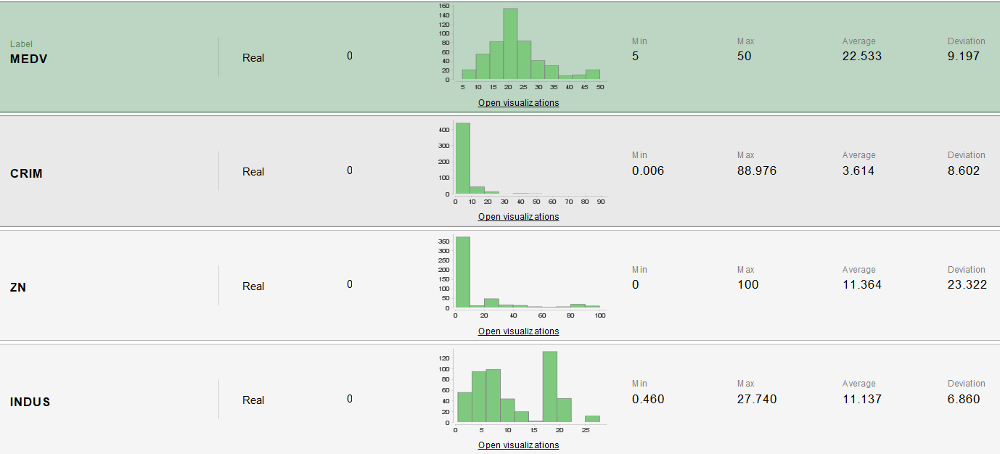
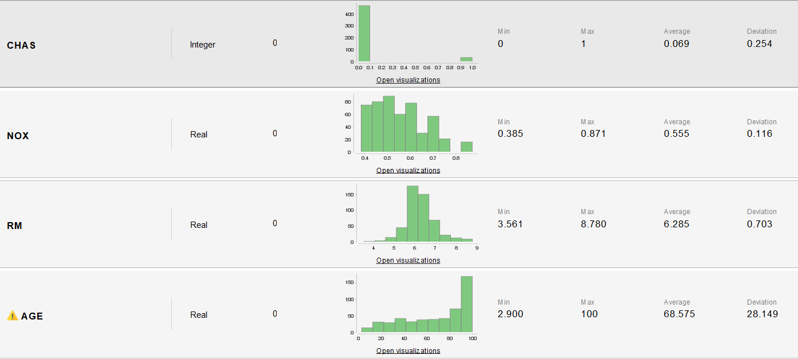
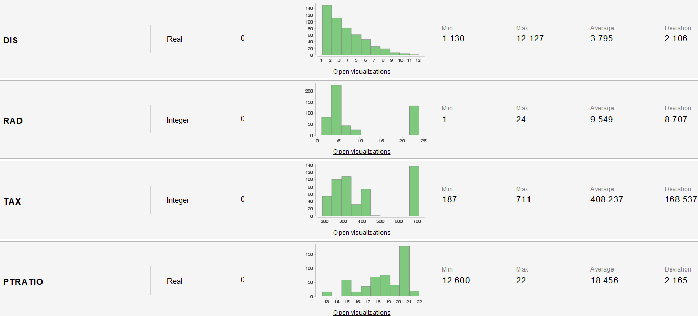
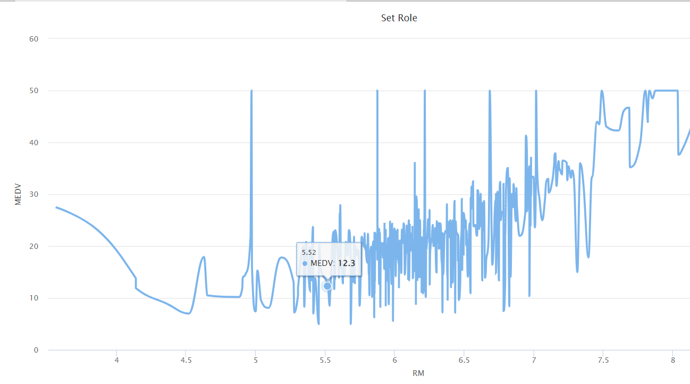
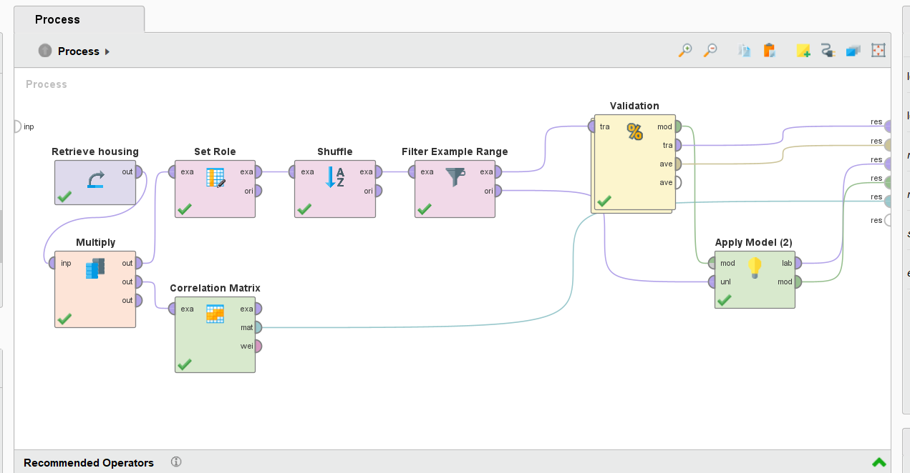
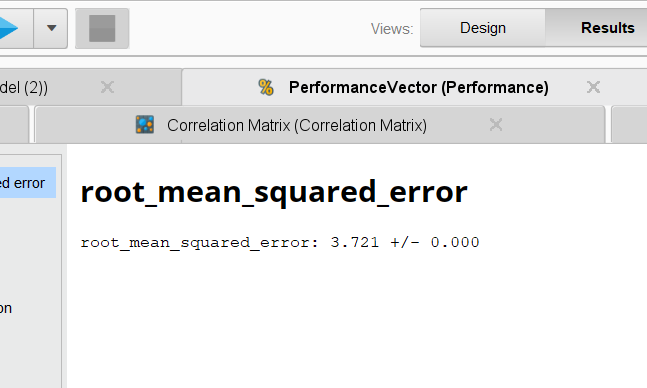

House Pricing

# Contexto
El conjunto de datos para este proyecto proviene del Repositorio de Aprendizaje Automático de la UCI. Los datos sobre viviendas en Boston fueron recolectados en 1978, y cada una de las 506 entradas representa datos agregados sobre 14 características de hogares en varios suburbios de Boston, Massachusetts.

Para mas información sobre el dataset visitar:
<a href="https://www.kaggle.com/datasets/schirmerchad/bostonhoustingmlnd">https://www.kaggle.com/datasets/schirmerchad/bostonhoustingmlnd</a>

# Objetivo:

El objetivo de este proyecto es desarrollar un modelo de regresión lineal para predecir el valor medio de las viviendas en distintas áreas de los suburbios de Boston, utilizando las 14 características disponibles en el conjunto de datos. A través del modelo, se busca identificar qué variables tienen una mayor influencia en el precio de las viviendas, así como evaluar la precisión y el rendimiento del modelo para realizar predicciones fiables.

## Predictores:
- CRIM  Tasa de crimen per cápita   
  Real, entre 0 y 100

- ZN       proporción de terreno residencial zonificado para lotes de más de 25,000 pies cuadrados.
  Real, entre 0 y 100

- INDUS     Proporción de hectáreas dedicadas a industria por locación
  Real, entre 0 y 100

- CHAS     1 si el terreno linda el río Charles, 0 si no
  Binomial, 0 y 1

- 5. NOX       Concentración de óxido nítrico (parts per 10 million)
  Real, entre 0 y 100

- 6. RM        Cantidad de habitaciones promedio por vivienda
  Real, entre 1 y 9

- AGE       Proporción de unidades ocupadas por sus propietarios construídas antes de 1940
  Real, entre 0 y 100

- DIS       	distancias “pesadas” a los 5 centros laborales de Boston
  Real, entre 1 y 13

- RAD       índice de accesibilidad a las autopistas radiales (1-24)
  Entero, entre 1 y 24

- TAX     tasa de impuesto al valor total de la propiedad en base $10.000
  Entero, entre 187 y 711

- PTRATIO  Tasa de estudiantes por maestro por locación
  Real, entre 0 y 100

- B        1000(Bk - 0.63)^2 donde Bk es la proporción de negros en la ciudad
  Real, entre 0 y 400

- LSTAT    Porcentaje de población de clase baja.
  Real, entre 0 y 100

- MEDV    Valor medio de viviendas ocupadas por sus propietarios en miles de dólares(Variable de salida)
  Real, entre 5 y 50

### Distribuciones:

<!-- 
 -->
## Preparación de datos:
Analizando la matriz de correlación :

notamos que el predictor "RM" parece tener mayor peso para determinar el valor medio de la vivienda. Podemos verlo mejor si graficamos:

## Modelo:
Aplicamos el modelo de regresión lineal ya que queremos obtener el precio a partir de operar con los demás predictores. éste hallará el polinomio cofactorizado y lo usará como función determinante del precio.

¿Por qué usar regresión lineal?
Dadas las características del dataset, nos encontramos con un problema de regresión , el modelo necesita predecir un valor numérico para el valor MEDV. Además el Dataset contiene la información a predecir, por lo que es un problema SUPERVISADOS

## Resultados:
Una vez entrenado el modelo, podemos observar que coeficientes usó con cada predictor:

Analisando algunas predicciones:

Performance:

Esta métrica fue obtenida utilizando el método Cross-Validation y nos indica el margen de error respecto al precio predecido con el real (en miles de USD$).

