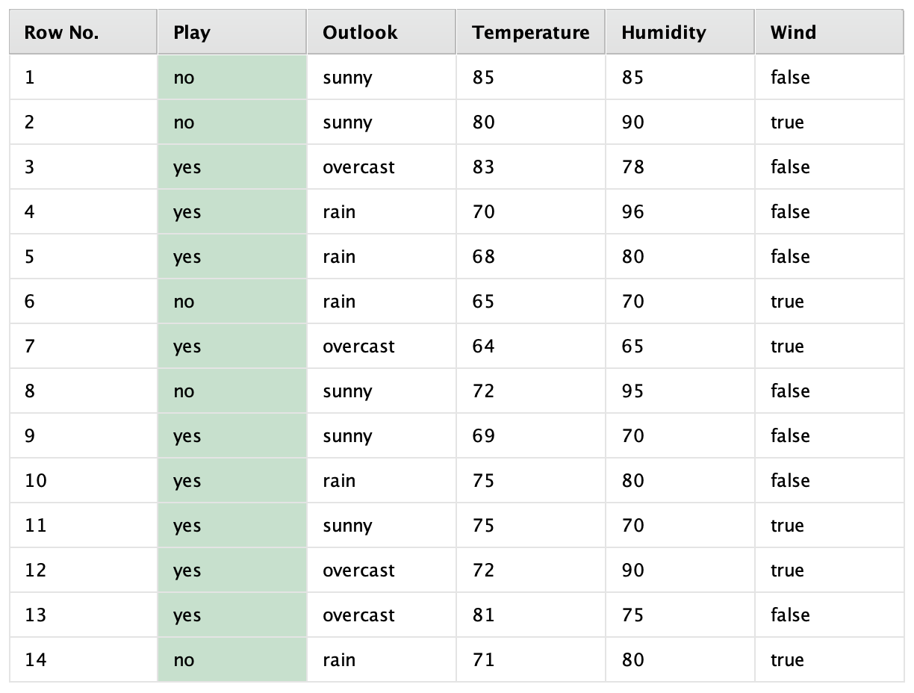
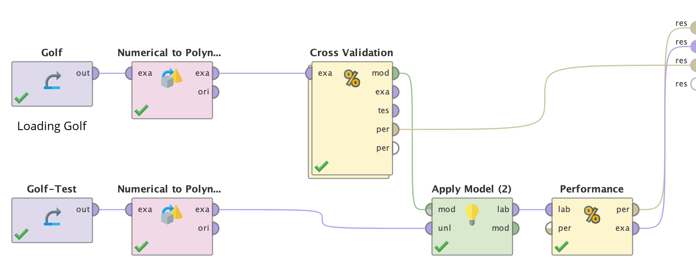
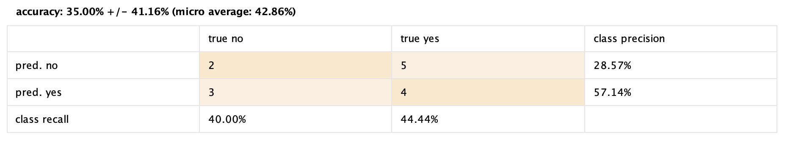
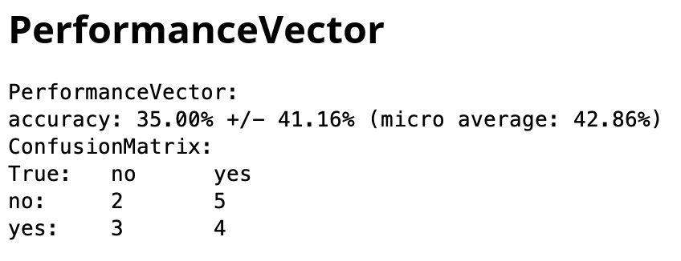
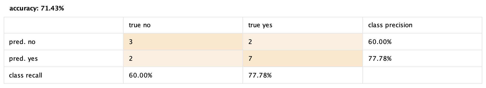
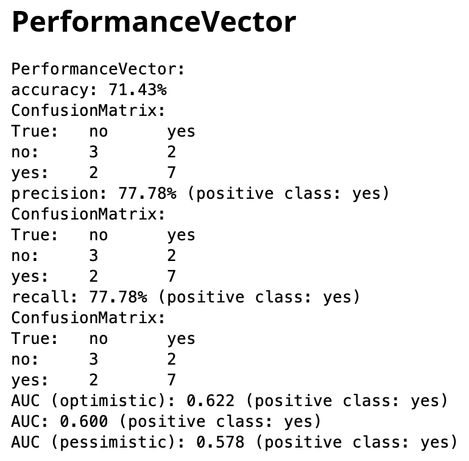

# GOLF
-----
# Contexto del caso

Para este caso de estudio, se decidió tomar un dataset provisto por RapidMiner, llamado golf. Este dataset contiene como atributos distintas condiciones del día, tales como viendo, humedad, temperatura y estado del tiempo. En base a estos datos, la etiqueta a analizar es si se juega al golf o no:

Se utilizará un dataset para entrenamiento y otro para testeo del modelo.

-------

# Objetivo

En este caso, se evaluará en base a las condiciones climáticas, si se jugará al golf o no. Para generar el modelo, se aplicará Naive Bayes, dado que es un problema de clasificación y la salida es binomial.

-------
# Pipeline

El flujo del proceso se diseñó utilizando RapidMiner, donde se observa la preparación de los datos, la validación cruzada y la evaluación del modelo. Se detalla a continuación:
	
###	Preparación de los datos:
- Carga del dataset: Se cargaron los datos de entrenamiento y prueba.
- Transformación a polinómica: Se utilizaron operadores para convertir las características numéricas en categorías polinómicas, ya que Naive Bayes funciona mejor con datos categóricos.
### Entrenamiento y validación cruzada:
- Se realizó una validación cruzada para entrenar el modelo con el conjunto de datos de entrenamiento y evaluar su desempeño en particiones internas.
### Aplicación del modelo al dataset de prueba:
- El modelo entrenado se aplicó al conjunto de datos de prueba para evaluar su capacidad de clasificación.
### Evaluación del desempeño:
- Finalmente, se evaluó el rendimiento del modelo tanto en los datos de entrenamiento como en los datos de prueba mediante métricas.

--------
# Por qué Naive Bayes?

El presente algoritmo fue elegido para este problema gracias a su idoneidad para tareas de clasificación binaria, como la predicción de si se jugará al golf en función de las condiciones climáticas. Este modelo es especialmente adecuado para manejar atributos categóricos como lo pueden ser Outlook y Wind, ya que utiliza un enfoque probabilístico que trata directamente con datos de este tipo. A pesar de asumir independencia entre los atributos, Naive Bayes es conocido por ser robusto incluso cuando esta condición no se cumple completamente, lo que lo hace flexible para trabajar con este dataset.

Además, es una opción más adecuada para datasets pequeños, como el presente conjunto de datos de entrenamiento que contiene solo 14 filas. La simplicidad del algoritmo reduce el riesgo de sobreajuste y permite generar modelos generalizables con pocos datos. 

--------
# Resultados

## Cross validation con training data

-----

## Performance con test data

------
# Conclusión

Como se pudo apreciar en los resultados anteriores, el modelo pudo llegar a resultados aceptables con el dataset de test, pese a ser un dataset que solo contaba con 14 filas para entrenamiento.