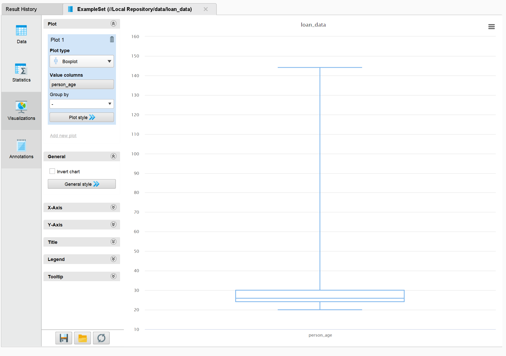
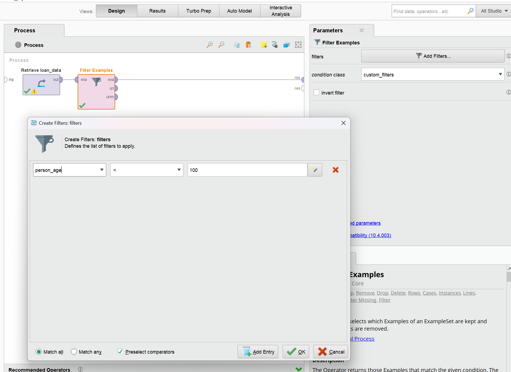
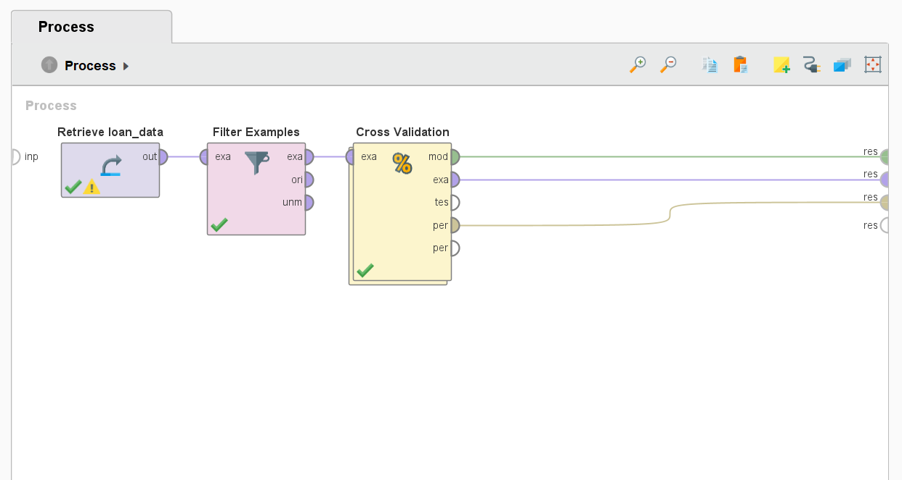
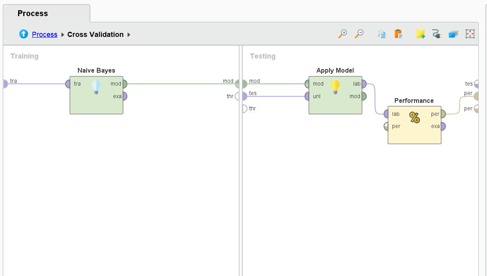
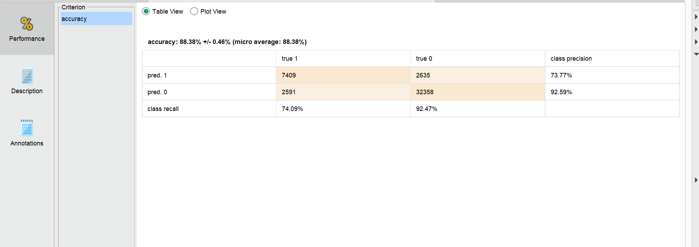

# Loan Approval Classification
-----

# Objetivo

En este caso, se evaluará en base a diversas condiciones de una persona, como pueden ser su sueldo, edad, nivel educativo, etc., si se le aprobará, o no, una solicitud de préstamo. Utilizaremos RapidMiner para el procesamiento
de los datos y la creación del modelo predictivo.

# Datos

El dataset contiene los siguientes atributos:

1. person_age: Edad de la persona que solicita el préstamo
2. person_gender: Género del solicitante (male, female)
3. person_education: Máximo nivel educativo alcanzado por el solicitante
4. person_income: Ingreso del solicitante agregado anualmente.
5. person_emp_exp: Años de experiencia como empleado.	
6. person_home_ownership:	Tipo de vivienda del solicitante. (dueño, inquilino, etc)
7. loan_amnt: Cantidad de dinero solicitado (préstamo).
8. loan_intent: Propósito del préstamo.
9. loan_int_rate: Tasa de interés del préstamo.	
10. loan_percent_income: Porcentaje que representa el préstamo sobre el ingreso anual.
11. cb_person_cred_hist_length: Largo de la historia crediticia del solicitante en años.
12. credit_score: Puntaje crediticio del solicitante.	
13. previous_loan_defaults_on_file: Indicador de "default" (cesación de pagos) en préstamos previos.
14. loan_status: Variable objetivo, 1 = aprobado, 0 = rechazado.

Analizando los datos podemos ver que hay un grupo de tuplas que muestran valores atípicos para el 
atributo "person_age"

En el siguiente boxplot se puede ver que hay registros de personas con más de 100 años

Aplicando un filtro a los datos obtenemos los siguientes registros de personas con edades superiores
a los 100 años

Utilizaremos un operador de filtrado para remover todos los registros con personas de más de 100 años

-------
# Pipeline

Creamos un pipeline sencillo, donde por medio un cross-validation generamos un modelo de clasificación.

Utilizamos un filtro para eliminar las filas con edades atípicas (>= 100 años)

Dentro del cross validation realizamos el entrenamiento del modelo así como la aplicación y determinación
de las características de rendimiento del mismo

Como resultado obtenemos la siguiente matriz, podemos ver que la precisión del modelo es de %88.38

	
<!--  -->

--------
# Por qué Naive Bayes?

El presente algoritmo fue elegido para este problema gracias a su idoneidad para tareas de clasificación binaria, como la predicción de si se jugará al golf en función de las condiciones climáticas. Este modelo es especialmente adecuado para manejar atributos categóricos como lo pueden ser Outlook y Wind, ya que utiliza un enfoque probabilístico que trata directamente con datos de este tipo. A pesar de asumir independencia entre los atributos, Naive Bayes es conocido por ser robusto incluso cuando esta condición no se cumple completamente, lo que lo hace flexible para trabajar con este dataset.

Además, es una opción más adecuada para datasets pequeños, como el presente conjunto de datos de entrenamiento que contiene solo 14 filas. La simplicidad del algoritmo reduce el riesgo de sobreajuste y permite generar modelos generalizables con pocos datos. 

--------
# Conclusión

Como se pudo apreciar en los resultados anteriores, el modelo pudo llegar a resultados aceptables con el dataset de test, pese a ser un dataset que solo contaba con 14 filas para entrenamiento.